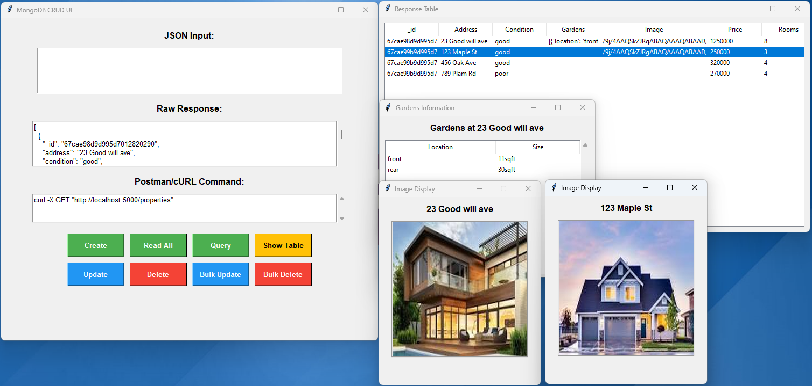
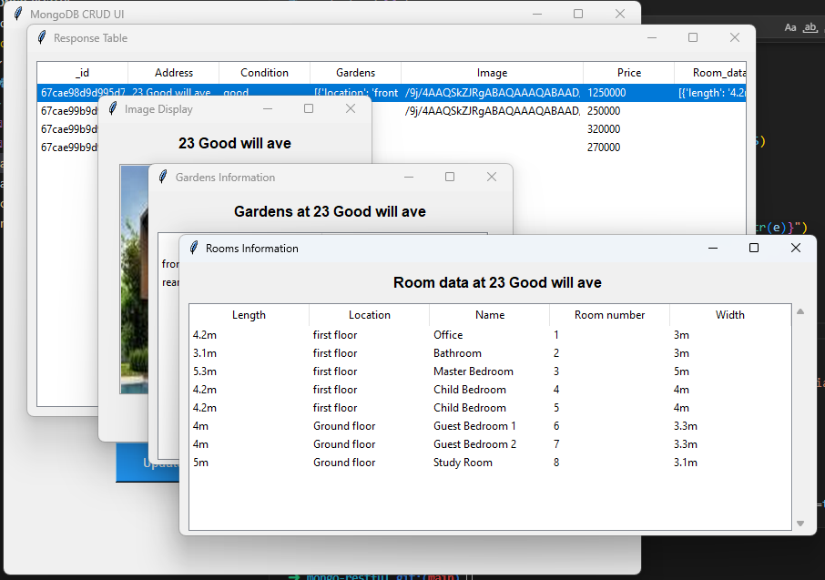

# MongoDB CRUD with Python API Server and Client UI

This project consists of a Flask-based RESTful API server connected to MongoDB and a Tkinter-based GUI client for performing CRUD (Create, Read, Update, Delete) operations on a housing survey dataset. The API supports single and bulk operations, and the UI provides an intuitive interface to interact with the data.



The purpose is to gives you a feeling of how api works and the basic api oriented database operations.

## Installation Steps
### Install MongoDB
1. Download and Install MongoDB [https://www.mongodb.com/try/download/community]
2. Set up the data directory for example in window:
```shell
mkdir C:\data\db
```

### Install Python
1. Download and Install Python [https://www.python.org/downloads/release/python-3132/]
2. Install the required packages:
```shell
python --version
pip upgrade
pip install flask pymongo requests Pillow
```

### Install Git
1. follow the steps to install Git depends on your OS: https://git-scm.com/book/en/v2/Getting-Started-Installing-Git
2. Test if git has installed properly:
```shell
git --version
> git version 2.45.1
```

## Start MongoDB
1. change directory into mongod executable file location
```shell
cd "<PATH TO MONGODB>\MongoDB\Server\8.0\bin"
mongod.exe --dbpath "C:\data\db"
```
2. MongoDB will run on http://localhost:27017. Keep this terminal open.
3. You can also install MongoDB Compass to help visualise the database, the uri for this connection is `mongodb://localhost:27017/`.

## Start API Server
1. Clone this repository into your machine
```shell
git clone git@github.com:cnjohnniekwok/pythonMongoRestful.git
```
2. Run python command to start the server:
```shell
python ./api_server.py
```
The API server will run on http://localhost:5000, Keep this terminal open.

## Start the Client UI
1. If you haven't done so in the previos step, clone this repository into your machine
```shell
git clone git@github.com:cnjohnniekwok/pythonMongoRestful.git
```
2. Run python command to launch the UI:
```shell
python ./api_client.py
```

# Test JSON Prompts
Below are example JSON inputs for testing the API and UI, Paste these into the UI’s "JSON Input" text box and click the corresponding button:

### Create (`POST /items`)
- Create a new record.
- Copy and Past the following JSON into the input field:

```json
[
  {
  "address": "123 Maple St",
  "rooms": 3,
  "price": 250000,
  "condition": "good"
  },
  {
    "address": "456 Oak Ave",
    "rooms": 4,
    "price": 320000,
    "condition": "good"
  },
  {
    "address": "789 Plam Rd",
    "rooms": 4,
    "price": 270000,
    "condition": "poor"
  }
]
```
- Click `Create` 

Response Example: `{"id": "some_object_id"}`


### Read All (`GET /items`)
Retrieve all entries.
- No input needed
- Click `Read All`, this invoke an API call to return everything from the database.
- Click `Show Table` to see the respone table.

Response Example:
```json
[
  {"_id": "660f8e2b...", "address": "123 Maple St", "rooms": 3, "price": 250000, "condition": "good"},
  {"_id": "660f8e2c...", "address": "456 Oak Ave", "rooms": 4, "price": 300000, "condition": "excellent"}
]
```

### Query (`GET /items/query`)
Filter entry by a condition.
Below input is a query on properties that consists of 3 rooms.
1. Copy and Past the following JSON into the input field:
```json
{
  "rooms": 3
}
```
2. Click `Query` 
3. Click `Show Table` to see the respone table.

Response Example:
```json
[
  {"_id": "660f8e2b...", "address": "123 Maple St", "rooms": 3, "price": 250000, "condition": "good"}
]
```

### Update (`PUT /items/<id>`)
Update a specific entry by ID.
1. Copy and Past the following JSON into the input field:
> [!NOTE] 
> Replace `_id` with an `actual ID`. You can obtain the `_id` from "Read All" or "Query", copy the `_id` from the raw respone field.

```json
{
  "_id": "660f8e2b...",
  "price": 260000,
  "condition": "renovated"
}
```

2. Click `Update` 
3. Response Example: `{"message": "Item updated"}`
4. Click `Show Table` to see the update respone.
5. Click `Read All` then `Show Table` to see the respone table.

### Delete (`DELETE /items/<id>`)
Delete a specific entry by ID.
1. Copy and Past the following JSON into the input field:
> [!NOTE] 
> Replace `_id` with an `actual ID`. You can obtain the `_id` from "Read All" or "Query", copy the `_id` from the raw respone field.

```json
{
  "_id": "660f8e2b..."
}
```

2. Click `Delete` 
Response Example: `{"message": "Item deleted"}`
3. Click `Show Table` to see the delete respone.
4. Click `Read All` then `Show Table` to see the respone table.

### Bulk Update (`PUT /items/bulk-update`)
Update all entry with a specific query condition.
The JSON below is to find all entries with 4 rooms, and update their price and condition.
1. Copy and Past the following JSON into the input field:
```json
{
  "query": {"rooms": 4},
  "update": {"price": 270000, "condition": "updated"}
}
```

2. Click `Bulk Update`
3. Click `Show Table` to see the bulk update respone.
4. Click `Read All` then `Show Table` to see the respone table.

### Bulk Delete (`DELETE /items/bulk-delete`)
Delete all entry matching a query.
This JSON is to find all entries that condtion equal to `updated`, and delete them.
1. Copy and Past the following JSON into the input field:
```json
{
  "query": {"condition": "updated"}
}
```
2. Click `Bulk Delete`
Response example: Response: `{"deleted_count": N}` (where `N` is the number of deleted items)
3. Click `Show Table` to see the bulk update respone.
4. Click `Read All` then `Show Table` to see the respone table.

# Playing with Images

### Convert image to base64 encoding:
Update the image path for the image you want to use, for example `./demo_images/house01.jpg` in `convert_image_to_base64.py`. 
> [!NOTE] 
> Please keep it small for now, just to illustrate you can store images in database with this method.

```python
import base64
with open("./demo_images/house01.jpg", "rb") as img_file:
    base64_string = base64.b64encode(img_file.read()).decode("utf-8")
print(base64_string)
```
Save the `.py` file.

Run the following command:
```sh
python ./convert_image_to_base64.py
```

Example output:
```sh
/9j/4AAQSkZJRgABAQAAAQABAAD/2wCEAAkGBwgHBgkIBwgKCgkLDRYPDQwMDRsUFRAWIB0iIiAdHx8kKDQsJCYxJx8fLT0tMTU3Ojo6Iys/RD84QzQ5OjcBCgoKDQwNGg8PGjclHyU3Nzc3Nzc3Nzc3Nzc3Nzc3Nzc3Nzc3Nzc3Nzc3Nzc3Nzc3Nzc3Nzc3Nzc3Nzc3Nzc3N//AABEIAJQAyQMBIgACEQEDEQH/xAAcAAACAgMBAQAAAAAAAAAAAAAFBgMEAAIHAQj/xABMEAACAQMCAwUDBwgHBQgDAAABAgMABBEFIQYSMRMiQVFhcYGRFCMyobHB0QcVQlJicuHwFjNTgpKi8SQ0Q5OyJURFVFWDlcIXZHP/xAAZAQADAQEBAAAAAAAAAAAAAAACAwQBAAX/xAAnEQACAwACAgIBAwUAAAAAAAAAAQIDERIhMUEiURMEMsFCUmFxsf/aAAwDAQACEQMRAD8ALYNYAamCjyrfkr1dPOIFBzU6VsI6ljhNY2cepEW/jVfU72LSIuc4eZhlI89fb5CvNY1WLSLbvcrTMO7GftPpXHuJeJpdSuJEilco39ZKOr+g8hUttudIoqr3tnXdM4z06VlW657Rv2hzJ8f4U0wPDdxCa1ZJlYbSRvzKR7q+Y4NSu4QB2hdB4MM/XRXTOJ7iym7W1mmtJupeJjg+0ePvqZWS9j3VH0fSNnARswyD61eFrDnPLg1x3QPyq38RC6jDb38P9pH3JQPXGx+Ap70rj/QdReNYrnsZX2MVz82c+hOx91Fy0zjg0FRAWdT3cdPKtTPnDBSPfUkoQxhgAysNj50Pit2Jd45SYwcjzArjSy08xizg5PlQyeZopFdhjw3FTXFxdRMpfHZAdQOtVLiVp42wuPGjjEBss3DApgkE9QRQw5DnG2eoqRC/Q9K9KHO4p0VgtvSIjJzXoWpAlSrHRNgkIQmt0j6VtNLBaxl7mRIkGMlmwBnpv4e+lXVOOIIpRbaTbveXX9kiEk4zzKcem4ZeYbdKBzSDUWNDtFAA08qRqWCgucAk9Bn1pX1jjS1t829gkk92ykKkSc7pID9Fk8QR+qT4+2gzadrGtjm1e+kt4Zl7NYYGRmmXqBz/AEJCOmCc+3O5fTdLsdMiPySBIkVu+5LgIwHUufnIG9GytKc2/Aagl5A0lvrvEBje+nWwtJ3E1vEkoPaEjBEchyFbGcKSPZ1FbcHWg03WdWjtzexpbFU7UqGaPc/1kY+kPPHT0ppCODKpV+0cZlVoVZpFx1kiHdlH7ce/psaX+GkjPEms9mYubtB2RhnKuDk7Ru2xO30W6+6lt9hpdDzZ3aSdmk/Zo8g+bdG5opvHuN93WiPYjzpH1HX9M0ztlluIXlYkSQpEeWRh+jNF/wAJ/wBtTg9d8gUO/pzpf/pWqf8AyR/Gi/IZwQbRM1Oib9K9jSrsUa4GatciJI0jgyNsVQ4g1q20O05n5XuWHzcf/wBj5CpOIdetdAs2kLK9yy/Nx5wMfrE+A+2uFcScQ3OsXcjSSsyu3fY/p+Q9APAVNZbnSKK6t7ZJxLxFPqtxJ88xRz84525/Qfs0ItrYzEZGF862tLUytzNsvjtR+2tY4IjNc8scK+fjUU5lsIfZvpelRTwSc6svLjBFV7zh5wMxMrDy6GiumXN1cLNLbckMabKjjPP47+VeRa4oJF3ZsuD3pIe8o93WlrkhjcGKs9hc2zZKOpHjWR3txFtIO0Xphh99OkV3ZXwxHJGT+qevwNQXGiW0wOIwreY6Uam0C4JlTQ+ONU0oBbLUZ4UB/qZPnIz6YOce7FdA4d/KhEgCananlJ3ltjzKP7pOfrrmV5w3IhzGQaFS2d3aNtzDHiDTFYLdeH0jBrWn61CX067hmU/8MHldfap3+qrlv2SRd4gk9VNfM8Gq3MDAvuV6MO6wpt0X8oWo2ZRGuBcR9OzuuvubrTo2LMEyrfk7OVAbI6Z2r3l5t6VdH/KDpV9ypepJZyH9Ju9GT7RuPeKb7Oa3uo1ltpo5ozjDRtkfGnKaYpxaILi4trNO0upkjUb94+Hn/HpSnqPG3bO1podrJcTnIBVfonG/UYyD12YEdDU3EHC3yhru8vNSdy8g+TWy5SJSenMAdyehO1VzaR6S0FgkMJaeMSAQpscDq6gHoBs2HO3UUidvYcYoGfmvUdUdZtcvG7NicW1sx5cEnmXOSWU4GyF8E9AKkEFtZXlta2MEcUMmBNIuCZAM43DDvZzuDG3mKL2ssd3EZY+Yow5XL7nrjlfOeb0yXP7IoJcXtvpmuPJcTyOqju8pBZWJOVJzkqN9j6ZUYpU57mDVEZQjDtObO+zlsbjwWTmGD5fOqD5OetbyvFaJ2s8ogSMbO8jJ2W/6xy6Kc9D2kfsFI+q8cmMKLJFtkUHkZ25nTp9EDHL7F2I6rSfc65eancfMJNcyZ2J6AnrgDZd99sD0reZqidI1DjHT7aPs7KJrjB5iCvZx5zucD6LY6PGQDnceSHqfEE6yXk8k8uL5uaVUfaTfIDeft860seFtX1Vx8qkaNT+go3/AUy8JcKQ3mqXdncrzCwAUcwyc7/hS5TXkJR+hKi/O2pvixt3VT0bHX0JNX/6Ea/8AqH4t+Fdu0/QrWyj+YiVMDdgKsdpp39vB/wAyP8aS7pekM4L2wZdTi07J5Noi+Hbl2X2+VGbVA3IdiCMgjpUNskGoWzc8a8hblZJB+l5Y86qw3M1jP8nbldO0Awm5RcHbHuH116ErUny3pnnKJxL8olzdy6/eQM7NEJG6nrgnA921LthamVwWx7Ka+M4Rc6resPGZiP8AEaARmSzgDonezjmIzj3edTSlvgujHPIUWOKwRDKOeVhlIV6+0+QreW3mkWO6vsHLgKhPKqj0+rejPBmjLeTGW8Vu1I5m5tz49fqqeZO0CB+h2PwrowxadKe9EumW8eJuyCBSoIC4wKIXemQ9kWhSNIimS488b7VW4dtTCJ4ebMaoAnXPL5E+NM0dh8ojEGQFQgkee3Sgcsm0FnwQlaloNu9q0vZKSo64weh8vZQqCz1CKLtbSZ+TfCOeYfXThra5s0S1D4w5flHdH0wR7ascN2ySaVDzDJJk8PWj8+QFqExdTu4Ty3dpz46tEfuP41It7YXXdMio525ZV5ftq5rRSPUpoBIM8xPL44xS2dTjuZCslnzQ/rN1/jWcEwvyNBO50i3lBJQAnyoNdaAyZMR2q0giQc1jNJbJjcFsKPuq0Lq/jQPLDHcR/rpt/D7K7i0byTF4Wl7at81zLjwHQ0T0viS90mdXImgcfpQsUJ9vgRRiErc2olETDrseoIqvNeGHuPbK6eTrkUqVmDY1JjFY8RQapyFb4C55uY8+QzZ8MHb128aYdf4y0+J7dmtFa+SEmRubs8EgqO/1I6nFcuurXR7yCR0ia1uApKhT3WONhg1Pw/w82rJFNdzTOu4CEnAAJGM9cUMXF9mWVJdf8LNzxM4QW9o8sjHIAhGGIPgW6keGNxVWPS9d1Fhyxi2U+Dbtj+fCuj6Jwta2sYEUKgHckjeiNxq/DOjN2V1fxy3A2+T2/wA5J/hXP10Sn/agOCXkRdI/J5zMGu2eeTPe584Pup70ng+2tUXniVVAOyriqGocX6q2m3FzouiR28UCc/aai+JGHpEu/wASPZTH/Qd9QQniXW77UAw71vERb2/ToVTcj2msbftm9LwUL3iDhrQ3EEl7FJcdBb2w7aQn2LmlPRdS1eTWtZuNDtIYmupAzm/BDQDJxlQdz6Uc4XsbW10izFnbr2rRDm7GPLZ/axuPfgV5w5p07a5rJWSFC0wJ5iWMfXrjbPpn4V0UseIxv7KlxoF5qbqeItZur1Wbe3h+ZgHU/RB7w9pr3+hXDv8A6Xb/AOL+NOsWhwkq1xNJOeoGeRfdjf4k1N+Z7L/yyfXXcmjsiBNfutO0q2j7bu3RkLNDGdidvH9Hr1xSbDrqSXczqqfOLyozE4iOT0B88gZ8K344mUR3MLfKHG8kTHv8oG2eYHGO6TgeXwR7W5MJ5gzMAc7qAffQWJylqERRf1FCzOTgnJ3ByOvgaGrDzWu4zi4UfFhRkjt7ZZevNv8AXVRI/wDYpNul3GP8wo1Iqz4jvw0gW+m5Rgdnt8DQVhvGP56Uw8NjN7Nt+gPsNBHTEkQ9DVKfQhov6AnPcSrgn5vy9aI6vqsemubcHrys6t4YHXHXFVNC50a55cglBj40V4h4ci4gnhvFuxF3QkqouSw6beXU70i2Gy5Jhc2o8SrcXMV5oduwVIknyqcjZG/N18tzUVpY6naWi28ca8il+8jBiQceHX6qJarpsen2Nrb2cRl5AGw48Tzb+m1G9NtI/ki5jAO+cE10W/B2/ZxaS1eDia6aZZQ7ZwZQRnYdM7UDBCjwCiuwX1t2PEqfOyNG0D5iY5XOV8KWNS4ZsJN7ixtWTOA9uWhP+FcL/lpyYG9CSt1GNNuZkIcIyjbzq1C8sugW86FlZpTzcm2RzHrR08G2cljcQ2tzPAHZSVkUSAb+Ywavw8Ny2fCqQkxzyJKcdif2z54PSslLo2KKekQFlcK5HfbGeh3otJpSyp3kVvZVLST2fMjKwPO2+PWj8Kpy/OuAOuWGK8a+bU3h7dCTrWi1c6FCwPcIPlijVraT6JwfJd2ccTTxZZRKpK7vjz8jRcvGECxBm9RvUmruf6HXHcUIyY5c7nLUVNs5PGKvjXFahdsra91mJn1rULiWIrkRRv2MfTyXGfjWmhaTHb9i1hYK0vZjJWPJB2zvVzR9FWeVGuVklQYIQueUY99P0LBFKhQPQLimKTlJrSa2SiliFwcP3V/EyXXJDHIuGGckDNNS2pmTmvrma4PgrNhT7hioWuYEYrLPGh8AzY+2p4ZopmxHMjco3CuCafFolbbCFtBDAg5AqgbgYxil3h5lOv64VOQJcEjzyaY48cgY5IUbkjwpd4ftZF1zVbpIZI4pn7vMuA25O2fbVMX0LYdmMUEZkZhGo6t0H4VQ/PFn/wCYX/ln8a24gtpLjTZolj5nI2HQ1zv+jeu/2EX+NfwruKYLm0VOMjdaPd31pZzdpp/ZqgHLsPQ77Hc7+Nc/ln5mLOc4HdHgPLFPnF+m3Lz/ACi0ulnsXPI0o/QUnb20gapAsF1OjuO1RjnlwFx6e2k1y5+QYyGyyAbTYiMHIPQetVSMWU5//cj/AOoVZ0s/9lW4/ZqmJGNxLb4UxmbnO3iP9KH+pnoJfBDno97HZ3E7ujscBQFHoR1qr2Cs6SMclc4wdv41SOqWttEFkftH/VTf40LvNduJgRHiBPJdzTvlIX8IjhYX1pZNJLeXMcQC7A9T7B41SueLbedzbWdtIwcH51nMfgegG/xPupLy0jFnffzJqaAIkikOeY7ZzXZFLAWnJ6O1lxSYY2jvY55R051fm+38aLWnGFgiBEuDGu+FmjxjPqK5+ZVaMKG35gP41qgSXmPMPLFAtQXFMe5bmLUNahnt57eTMD55X8crW+pWsyWp7NQzZBCsuc0gR25B2w2TjDeFELKa5t1+ammReoCSHH87UX5Ggfw6GlEx06cXSgO5XC4x4jpRS2gKcOFuQDDHb+8aXU1C5XuliRnByu+3rVgcTy/IpLE2sbKP0lkIPXPT413NMxwkvRZ0bRo40ZhI7s7lsZ2+FELqJMvzIDyqMBlodpmtWqoUnWVe+em4Gd6lv9fsFZkSZ2LDblycVFbFuXRVVJpdhL5MDCp5FGw6Ct9WiC8GSgnGQOv79L0vE/zY7G3yP13b7h+ND7viLUbm0+Rl1EJ6qq9d81ldcoy1hWSUliHvSprawiRbohGkwqs+yLkH6R+rp41FqWq6WIZYm1ABXXAa3Y8y7eY3Fc8aW6mx2s7NjpzMTivBBk998mmRrURUo8n2WpbXS0mdo57y4bJwZOXp4EEgnPtqzpt3+b5O1skHakYEr95h7KrRxxjGNzU4V84UUxI3igzpOp6he67YC6vriVO3TKFzydfLpXUIj3lz+Fco0FWTXLAk/wDeE6H1rqUbnn6fVR+hM/JYuZAFPMFI9RQ7to/1UqHV7nkXlHU/z0oR2r/rClrWd0hC1WeO2sXtpHCpJEAwyO8B9p/Guf6tBDlnhyU/Ryc49vrRDWr1r92k7YkoCT8cb0Kkd7SNI5B/WoMdKOipxWshimMdhqdjHp8ULXcSuq45WbGKFPfKZ5W5wwLnGDsRnzoaLZTO3K3dGMZPWiVldtCFjaEbEgnlzTWlHsfK54keC7Mink2UDJ5R0rQXkak5cg42xjrTFo8mntKH1G3injjYThXhDK0S/THtwT8BUuraZpt7cm4g0uG0R1BSGEFQB4ZAPUjBNYpcl2FCWip8vbIMY3ByD61HJdTyMWLbk5yKNzaXp0Jw8ixeQL5Jqe14curkBtP029uATs3Zci/F8Ctwb2LgFzKwPM5PhRmy0h3hjkS7eNmGSKY9C4P1PU4e2RbS1iDumZWLsGVip7owOoP6VeaJYXGoPJALiOMxqd+zyDuRtvSrbFGO6Oqim8YHGlalF3or1cn9basY63bleYRyjPRTTXdaLewW8kzTW8ixqWPUZAqtLoWqOiyLaRSKQCOSYZ+vFSL9Rq3UWOqHgAJq+owj56xc/unNRS8RAAhrB1Y+LDajiWV2JHjaxm5oiA4XDcpIyOh8qqa8nLY8rQzK7OqqDGck56Db0o42bJLAZVJRb0CjW7pnzDGkYJyc16J5JG55JVH7q1ateGdZuwPk2kXT58WURj4sQKIXHBWvWVg95dWttDGhUFHuQz7nHRcjx86obXjSbc7A4kHgWb7qkE7deUe3Bp5tvyXThv8AbNZgRfHsbck/En7q91LgTS9Pm0wSajdzpcXYinyyoOQqSccoyOnnQKcH1pzlnoS0mbqZMD2Vut7aRycjyjm8iwrqC8NcA6ZH2k0Ni+2f9quDKfg7EUK4r1jhNNOtLfSHs8xX0ErC1iwBGrZO4GOnhRJrRbmxYs5bm4wtnp1/cnygs5H+vGKMW+gcU3RxFw/PEPB7meOMfDJb6qZv/wAoaIQfzfBf3g84ocjHx+6tTx9q90D+beFNRl8u0Ur9ook89Aucipo/BnENrf219evpsEUMod0jd5WYDwDYAB91OfOADuDj0zSxaa5xveXcAueH4rSwZx28kkqllj8SO+N/caPzyEROeuFJrm9B/wBgvUJS83LkEDwFQ4/ZPwqAzc9wSfHp/Iqbmbz/AMorF0ccLkinkMrwoyphlfm6emP58aD3MckDrHKveB3FOlwxhiSIfPcpADNnc+8770q6q/bskgUkZOWbffPnTq56yRM0EgQMOXlC4Y461bt5JGm5F6ltj5eoqhEFMhLDHkD1I9tGbLTri4itmtmixKSoJbHTqOn84o5I1rUTzxgKlpuyGXZxtgZyR8OtM3OI4xG/PzqTzc2Mj4Uu2ujapDqMUEhQylWlUJIOg26++jF8GS6KygI3KMrzZ3x1qeScWNoXyxkvB9ybPRNYhj0u5u5JXkBmjQcsa8gHeJ95x60y2GvcT3Vpbrpeg9wRAJLKx3AHXqBVLgNR+bNdUsygRyuAD3c8hG491dG4XiB4e0zcf7rH/wBIpU7V30VqOLyInDOncQ6npIuY9fWwtnuJswwWy83P2jc3eO/XPShHDdhPeXE0cF7NbtHuzp1bLY3p64HRH4UgQkZN5ckj/wB56WeABG1/qfaDIVFA385KRda2rEvQyvE4tk+r6ZqVtptzI2sGSNYzzxmJe8PHfrWqRa0lvFyX1jIrIuFZWUjb0FHuKbRIdDvmWP6ML+PoakjtVGm2zBMHsozn3CoFY3Bb9lSzl5AmlW+ufLr8RW1pLIrRmXEhAGUGMZHlWvEw1tYdP7bSiWF9EYgsq4d8NhfTxpx4bj/7Z1wZOQ1vnH/8hXvGKYXRN/8AxeDr7Hr0Y0xcuWEkrpeBQmPGzZ5dDtYfWWfmP+XNB9di4oXSZ5NSu7eKFQCY4rdsNvt3jXYZICc79aTuPxI3C+p/NDsolQGQn6TZGwHp50MYJTWRRznq7Yq2mh8SajBFLdcTiEOgYKvaHY7745RQXiDRpNNms45dUlu/lLN38kcuCoyNz+t9VdV0WyifQ7PnRW5rdNmXI+iPCuf/AJRrP5FrenpbW8UcLxZTs0C878/ezjy7nsrKbZO7i89+EdZGKiMll+TPQsfPveSupwcuFz8BQfizhzS9D1rRI9Pt2RZrhQ5kkL8w51866Po0V2LSH5cAtyR86qdM5OPupQ/KUoXXuH8j/vKj/OlF+nvlJ5IVNR9DvIYoG5IuzB8egwKgNyCQBcYUYwSpOarXzMiXE2FJjRmBPjgbVz0cc6nzRkwW+XXmKRhs+lTQdl2uKWIdxjFdnTxMj2sqkkuEOTjYihd2w+SykEfQPrSTpXGGqXur21uWjEE0oVlWPopPnTjcuBbS5P6J/Sq+mMoxyQizN6AWcNsw9nStuc/tfAfjUWQd8/5q2wfX400Wcu4gKuV5VYCQEL3u7zfyKXJLaaUhI4pHwAxA3ps1CAXVxCwlVeVgSAdtjWi6tHbzBYYlDMxBb0H8mi5OvpIkXQAstJubgqojZgrbpuMDrn66dJ7WK306AWyBXhlVuUHOCOv30Ih1gu/MihHOX9wO1SWWrv2UnynGSxOM9c5NBK2zdSN0MQTZ4kbm6Gz7h8u/v91V9Vy9+57o2HX2VV066ga/a6ZwMwiPc9Bn/SrlwYprkyI3OvTIpjnygUUfuDPBEUb6JrjEMZTG/dHlyNv9tdG4ZlhTQNLR2Ac2ke392ud8APbLw9rsst0kc7JIixsQMjkOD8Tj3U36BqOkHR9ML6taRyx2kaMhnQEEDp161Jw+ct+/4KXLoo8GX1jbaDCl3eW8Lm5uCFkmVSfnm8Cc0u8AyWw1LUxc3MUCfNlWkcKGxITsSaaOBokueGbdRfi3xdXJ2CEkds3mPZ8aVvyeIW1jVk7YxMAhEmFOe+fPbpS51xirJfZqe8UOfF09u3Dt+yTI2YHxhuuxq9pc9t+b7Vu3TKwxk4cbbChXFNpE+ganJ8oDusDsdhucHwFWbKPOm2ay3oKm3TbCjHdHl199RqtOPX2O94SW+uWOkarxDd390sURmt1BO5Y9iOg8aqazxPpevNoqabd9rImrQsUKlSBhhncedJHG17JZ8SzvBKrrHNE4PUEiJf8ASq+q8aQano8lq8c9tcEq6SQt3VdSCD4EdK9eFScd0jk8Z26a5liR5JIyqrvlh1pU47Sf+hGomdGVuzUsCds5GTVngfWo+JuD1Gp3PzqloJHLAM3L0b2/eKqcXayl8k2jSGJ7d41Ej45i3jt4fVSXVkk2zYy30G9CTOiaacHBtY/+kVynizX4+J9W00WsBja3laKMc4btSzrykHwzj6xRGXWJIIxC99ci2fEbxxPy90DGB7q90l+G9LvEuora4aWPeMy5bk8MgdM1tFEYSc2+zZybWDxxHxTDoOmw3lzaSvJK4QRLIOYHGTv08KRb7ii04w17TT2ctgLHNwzSFXVgpU4zkYzirHE1/pesBbmb5QZ7cARxtkRjJ3PL0Jx50oW91Z2msQXUqF4YZQ7RooBbByB8cU+FFEe4rsU3Pe/B1DXOKlitZpodJvHhK8jTzxmGM82wxzAFuvgKWtC4Qh1myW7s7yNVD8kkRhLcrAbj6XrS/wAYcb3PEKxwCFLe2jfnC82WJ8Mnp7sU0fkoMjcNamweRQLpsEHGD2aUqVCqg+AyM232XW4TGjY1aTUFkW2cMyiLHT15tvhRCXUIns2IlByOUlW8SKVOIeInmt5U5zzyKpdQfHIBHxpft9clieXnLYicsdsnbYe3dhS4Ss9k87tkNt9cdlGjZJB3yT61v8qj/tE+ql671APp6gFXYMQox55H20qdsf11+H8a3JS7FOY8SuqxTKkMDvykYCKMbHfYUi3uh6ok/apCJEJ5sq46dDsa7bLrPCUOzRQH0EJP3VXk4m4VjwFtEbbHdtf9KdV+mtrfQTcPs4YLPUI3w9vIP0TjHTH8BU9ra3z84kgYk4Ys2Nz0I+FdY1DUeHtYnRhYyrHGCpKqF+qq7aRoM+1vfSQejoCPuql1WNeDU6/s57LHf2jv8gtRIXlOS2CAvhgZFXo5tQKjtLRQfIEAU6f0Vldc2Wq2s3lz5Q/fUD8M63GCVhSb1jYNS5VzSzB9cq14YuwRhUxJpyYPrUxTTwmH01gfMOdqLPHqtn/vGnPgeJiP2iovzzENprSJvDZtx9tJ4zXopUov2D4104J/u9wp8MMfxqO2tdKEpMvbBT6kfYaLDUNPk+lbMv7oB/Ct1k0mTZmZP7mfsoXvfk1cSibHQXGBLIvnkyVct9O4e5AGnQH9qRhVlLLSpfo3MX944qQcPQzf1M8bH0bP30p5/kPr1gA1zSbCVAlg6ZB+mr5Ps9lAxw1LIwUM2T4hhTpLw2yHr7MZqM8PXH6Oc+2nxsxZoEoaXuFuEdOGmLDeW8csuSzSEnmOfOttV0SHTJFGnwKkeDzA56/GhL6RcJ9JmGP2v41QuNOmkmbNzzZ3wX6fXS2te6aont/azyMvKyxEH6SjJ+uoDa3yb/nEe1kT8K1fSRg810v+LpVd9Kt+rXA9oBP3UxNAOLJ5vlgRlk1C2dWG45VBoFPBKdjPb/8AMFXn0+1XpPM37sX8RVaSwmcZti0iA4bnAXB+JpkZYKl15KElvJne5t8fv5+ymDR9RisbVLe3129hkc5aG35wjMfXGPLegz6Xd8xL9mFHjzbVvBpUhYFpFjYEEZYV0pprBH5Iol1+fumSKd2OGyzjBJB60F+XSiVZ8kqeVgPXO/1ijGsKVhVJCr85Khj69aBBC04QL3dyoUDYYzRVJcRK8hj5dIyME5wcDmJ8d/41Q7eb9b7KkiQo4Rj3slRk49atckX6o+uszDMG25HO6ltzmpFRSBkVlZXr4sPNNUQA7ZHU7VvE7EHLE74rysrA0y3GSuCpIPmKupe3UR7txIQPBjkfXXlZRIOLel601/UA/KZAwHmKPpOL2IfK7e3n2/4kQb7aysrHCP0OjJkicPaPeLzSafCjHxjyv2UO1Dg7TFidomuIyPJwftBrKyo7IrCmEnokXECRXUka5IU4BPWtAgK77+2srKnwp0s21zPGpCSyAZxgOcVYDvJ9Jic17WVHNfIsr/YRyIoHTPtq5YadDdYDlxn9XH3isrKZXFMGxteBktOENMlUNI1wT++B91Xo+D9GTrbs37zmsrKojGO+CWUn9k6cN6Mn/h0Dfvjm+2p10fSwpUadaAeQhX8KyspuIU2VpOF9Dl+lpluMdOVeXHwqnNwRoMhJ+SshIxlZCKysoHFfQGIAanwBo0i557xeU8wxKOvvFJOp8J6fpztJC9w5DEgOwwPTYD0rKyuxKPRmASK1jnZnYsG7TOx6HI/E1e/NEP8AbTfEfhWVlAYf/9k=
```

### Create an entry with image key

1. Copy and paste the following JSON into the input field.
```json
{
  "address": "23 Good will ave",
  "rooms": 8,
  "price": 1250000,
  "condition": "good",
  "image": "/9j/4AAQSkZJRgABAQAAAQABAAD/2wCEAAkGBwgHBgkIBwgKCgkLDRYPDQwMDRsUFRAWIB0iIiAdHx8kKDQsJCYxJx8fLT0tMTU3Ojo6Iys/RD84QzQ5OjcBCgoKDQwNGg8PGjclHyU3Nzc3Nzc3Nzc3Nzc3Nzc3Nzc3Nzc3Nzc3Nzc3Nzc3Nzc3Nzc3Nzc3Nzc3Nzc3Nzc3N//AABEIAJQAyQMBIgACEQEDEQH/xAAcAAACAgMBAQAAAAAAAAAAAAAFBgMEAAIHAQj/xABMEAACAQMCAwUDBwgHBQgDAAABAgMABBEFIQYSMRMiQVFhcYGRFCMyobHB0QcVQlJicuHwFjNTgpKi8SQ0Q5OyJURFVFWDlcIXZHP/xAAZAQADAQEBAAAAAAAAAAAAAAACAwQBAAX/xAAnEQACAwACAgIBAwUAAAAAAAAAAQIDERIhMUEiURMEMsFCUmFxsf/aAAwDAQACEQMRAD8ALYNYAamCjyrfkr1dPOIFBzU6VsI6ljhNY2cepEW/jVfU72LSIuc4eZhlI89fb5CvNY1WLSLbvcrTMO7GftPpXHuJeJpdSuJEilco39ZKOr+g8hUttudIoqr3tnXdM4z06VlW657Rv2hzJ8f4U0wPDdxCa1ZJlYbSRvzKR7q+Y4NSu4QB2hdB4MM/XRXTOJ7iym7W1mmtJupeJjg+0ePvqZWS9j3VH0fSNnARswyD61eFrDnPLg1x3QPyq38RC6jDb38P9pH3JQPXGx+Ap70rj/QdReNYrnsZX2MVz82c+hOx91Fy0zjg0FRAWdT3cdPKtTPnDBSPfUkoQxhgAysNj50Pit2Jd45SYwcjzArjSy08xizg5PlQyeZopFdhjw3FTXFxdRMpfHZAdQOtVLiVp42wuPGjjEBss3DApgkE9QRQw5DnG2eoqRC/Q9K9KHO4p0VgtvSIjJzXoWpAlSrHRNgkIQmt0j6VtNLBaxl7mRIkGMlmwBnpv4e+lXVOOIIpRbaTbveXX9kiEk4zzKcem4ZeYbdKBzSDUWNDtFAA08qRqWCgucAk9Bn1pX1jjS1t829gkk92ykKkSc7pID9Fk8QR+qT4+2gzadrGtjm1e+kt4Zl7NYYGRmmXqBz/AEJCOmCc+3O5fTdLsdMiPySBIkVu+5LgIwHUufnIG9GytKc2/Aagl5A0lvrvEBje+nWwtJ3E1vEkoPaEjBEchyFbGcKSPZ1FbcHWg03WdWjtzexpbFU7UqGaPc/1kY+kPPHT0ppCODKpV+0cZlVoVZpFx1kiHdlH7ce/psaX+GkjPEms9mYubtB2RhnKuDk7Ru2xO30W6+6lt9hpdDzZ3aSdmk/Zo8g+bdG5opvHuN93WiPYjzpH1HX9M0ztlluIXlYkSQpEeWRh+jNF/wAJ/wBtTg9d8gUO/pzpf/pWqf8AyR/Gi/IZwQbRM1Oib9K9jSrsUa4GatciJI0jgyNsVQ4g1q20O05n5XuWHzcf/wBj5CpOIdetdAs2kLK9yy/Nx5wMfrE+A+2uFcScQ3OsXcjSSsyu3fY/p+Q9APAVNZbnSKK6t7ZJxLxFPqtxJ88xRz84525/Qfs0ItrYzEZGF862tLUytzNsvjtR+2tY4IjNc8scK+fjUU5lsIfZvpelRTwSc6svLjBFV7zh5wMxMrDy6GiumXN1cLNLbckMabKjjPP47+VeRa4oJF3ZsuD3pIe8o93WlrkhjcGKs9hc2zZKOpHjWR3txFtIO0Xphh99OkV3ZXwxHJGT+qevwNQXGiW0wOIwreY6Uam0C4JlTQ+ONU0oBbLUZ4UB/qZPnIz6YOce7FdA4d/KhEgCananlJ3ltjzKP7pOfrrmV5w3IhzGQaFS2d3aNtzDHiDTFYLdeH0jBrWn61CX067hmU/8MHldfap3+qrlv2SRd4gk9VNfM8Gq3MDAvuV6MO6wpt0X8oWo2ZRGuBcR9OzuuvubrTo2LMEyrfk7OVAbI6Z2r3l5t6VdH/KDpV9ypepJZyH9Ju9GT7RuPeKb7Oa3uo1ltpo5ozjDRtkfGnKaYpxaILi4trNO0upkjUb94+Hn/HpSnqPG3bO1podrJcTnIBVfonG/UYyD12YEdDU3EHC3yhru8vNSdy8g+TWy5SJSenMAdyehO1VzaR6S0FgkMJaeMSAQpscDq6gHoBs2HO3UUidvYcYoGfmvUdUdZtcvG7NicW1sx5cEnmXOSWU4GyF8E9AKkEFtZXlta2MEcUMmBNIuCZAM43DDvZzuDG3mKL2ssd3EZY+Yow5XL7nrjlfOeb0yXP7IoJcXtvpmuPJcTyOqju8pBZWJOVJzkqN9j6ZUYpU57mDVEZQjDtObO+zlsbjwWTmGD5fOqD5OetbyvFaJ2s8ogSMbO8jJ2W/6xy6Kc9D2kfsFI+q8cmMKLJFtkUHkZ25nTp9EDHL7F2I6rSfc65eancfMJNcyZ2J6AnrgDZd99sD0reZqidI1DjHT7aPs7KJrjB5iCvZx5zucD6LY6PGQDnceSHqfEE6yXk8k8uL5uaVUfaTfIDeft860seFtX1Vx8qkaNT+go3/AUy8JcKQ3mqXdncrzCwAUcwyc7/hS5TXkJR+hKi/O2pvixt3VT0bHX0JNX/6Ea/8AqH4t+Fdu0/QrWyj+YiVMDdgKsdpp39vB/wAyP8aS7pekM4L2wZdTi07J5Noi+Hbl2X2+VGbVA3IdiCMgjpUNskGoWzc8a8hblZJB+l5Y86qw3M1jP8nbldO0Awm5RcHbHuH116ErUny3pnnKJxL8olzdy6/eQM7NEJG6nrgnA921LthamVwWx7Ka+M4Rc6resPGZiP8AEaARmSzgDonezjmIzj3edTSlvgujHPIUWOKwRDKOeVhlIV6+0+QreW3mkWO6vsHLgKhPKqj0+rejPBmjLeTGW8Vu1I5m5tz49fqqeZO0CB+h2PwrowxadKe9EumW8eJuyCBSoIC4wKIXemQ9kWhSNIimS488b7VW4dtTCJ4ebMaoAnXPL5E+NM0dh8ojEGQFQgkee3Sgcsm0FnwQlaloNu9q0vZKSo64weh8vZQqCz1CKLtbSZ+TfCOeYfXThra5s0S1D4w5flHdH0wR7ascN2ySaVDzDJJk8PWj8+QFqExdTu4Ty3dpz46tEfuP41It7YXXdMio525ZV5ftq5rRSPUpoBIM8xPL44xS2dTjuZCslnzQ/rN1/jWcEwvyNBO50i3lBJQAnyoNdaAyZMR2q0giQc1jNJbJjcFsKPuq0Lq/jQPLDHcR/rpt/D7K7i0byTF4Wl7at81zLjwHQ0T0viS90mdXImgcfpQsUJ9vgRRiErc2olETDrseoIqvNeGHuPbK6eTrkUqVmDY1JjFY8RQapyFb4C55uY8+QzZ8MHb128aYdf4y0+J7dmtFa+SEmRubs8EgqO/1I6nFcuurXR7yCR0ia1uApKhT3WONhg1Pw/w82rJFNdzTOu4CEnAAJGM9cUMXF9mWVJdf8LNzxM4QW9o8sjHIAhGGIPgW6keGNxVWPS9d1Fhyxi2U+Dbtj+fCuj6Jwta2sYEUKgHckjeiNxq/DOjN2V1fxy3A2+T2/wA5J/hXP10Sn/agOCXkRdI/J5zMGu2eeTPe584Pup70ng+2tUXniVVAOyriqGocX6q2m3FzouiR28UCc/aai+JGHpEu/wASPZTH/Qd9QQniXW77UAw71vERb2/ToVTcj2msbftm9LwUL3iDhrQ3EEl7FJcdBb2w7aQn2LmlPRdS1eTWtZuNDtIYmupAzm/BDQDJxlQdz6Uc4XsbW10izFnbr2rRDm7GPLZ/axuPfgV5w5p07a5rJWSFC0wJ5iWMfXrjbPpn4V0UseIxv7KlxoF5qbqeItZur1Wbe3h+ZgHU/RB7w9pr3+hXDv8A6Xb/AOL+NOsWhwkq1xNJOeoGeRfdjf4k1N+Z7L/yyfXXcmjsiBNfutO0q2j7bu3RkLNDGdidvH9Hr1xSbDrqSXczqqfOLyozE4iOT0B88gZ8K344mUR3MLfKHG8kTHv8oG2eYHGO6TgeXwR7W5MJ5gzMAc7qAffQWJylqERRf1FCzOTgnJ3ByOvgaGrDzWu4zi4UfFhRkjt7ZZevNv8AXVRI/wDYpNul3GP8wo1Iqz4jvw0gW+m5Rgdnt8DQVhvGP56Uw8NjN7Nt+gPsNBHTEkQ9DVKfQhov6AnPcSrgn5vy9aI6vqsemubcHrys6t4YHXHXFVNC50a55cglBj40V4h4ci4gnhvFuxF3QkqouSw6beXU70i2Gy5Jhc2o8SrcXMV5oduwVIknyqcjZG/N18tzUVpY6naWi28ca8il+8jBiQceHX6qJarpsen2Nrb2cRl5AGw48Tzb+m1G9NtI/ki5jAO+cE10W/B2/ZxaS1eDia6aZZQ7ZwZQRnYdM7UDBCjwCiuwX1t2PEqfOyNG0D5iY5XOV8KWNS4ZsJN7ixtWTOA9uWhP+FcL/lpyYG9CSt1GNNuZkIcIyjbzq1C8sugW86FlZpTzcm2RzHrR08G2cljcQ2tzPAHZSVkUSAb+Ywavw8Ny2fCqQkxzyJKcdif2z54PSslLo2KKekQFlcK5HfbGeh3otJpSyp3kVvZVLST2fMjKwPO2+PWj8Kpy/OuAOuWGK8a+bU3h7dCTrWi1c6FCwPcIPlijVraT6JwfJd2ccTTxZZRKpK7vjz8jRcvGECxBm9RvUmruf6HXHcUIyY5c7nLUVNs5PGKvjXFahdsra91mJn1rULiWIrkRRv2MfTyXGfjWmhaTHb9i1hYK0vZjJWPJB2zvVzR9FWeVGuVklQYIQueUY99P0LBFKhQPQLimKTlJrSa2SiliFwcP3V/EyXXJDHIuGGckDNNS2pmTmvrma4PgrNhT7hioWuYEYrLPGh8AzY+2p4ZopmxHMjco3CuCafFolbbCFtBDAg5AqgbgYxil3h5lOv64VOQJcEjzyaY48cgY5IUbkjwpd4ftZF1zVbpIZI4pn7vMuA25O2fbVMX0LYdmMUEZkZhGo6t0H4VQ/PFn/wCYX/ln8a24gtpLjTZolj5nI2HQ1zv+jeu/2EX+NfwruKYLm0VOMjdaPd31pZzdpp/ZqgHLsPQ77Hc7+Nc/ln5mLOc4HdHgPLFPnF+m3Lz/ACi0ulnsXPI0o/QUnb20gapAsF1OjuO1RjnlwFx6e2k1y5+QYyGyyAbTYiMHIPQetVSMWU5//cj/AOoVZ0s/9lW4/ZqmJGNxLb4UxmbnO3iP9KH+pnoJfBDno97HZ3E7ujscBQFHoR1qr2Cs6SMclc4wdv41SOqWttEFkftH/VTf40LvNduJgRHiBPJdzTvlIX8IjhYX1pZNJLeXMcQC7A9T7B41SueLbedzbWdtIwcH51nMfgegG/xPupLy0jFnffzJqaAIkikOeY7ZzXZFLAWnJ6O1lxSYY2jvY55R051fm+38aLWnGFgiBEuDGu+FmjxjPqK5+ZVaMKG35gP41qgSXmPMPLFAtQXFMe5bmLUNahnt57eTMD55X8crW+pWsyWp7NQzZBCsuc0gR25B2w2TjDeFELKa5t1+ammReoCSHH87UX5Ggfw6GlEx06cXSgO5XC4x4jpRS2gKcOFuQDDHb+8aXU1C5XuliRnByu+3rVgcTy/IpLE2sbKP0lkIPXPT413NMxwkvRZ0bRo40ZhI7s7lsZ2+FELqJMvzIDyqMBlodpmtWqoUnWVe+em4Gd6lv9fsFZkSZ2LDblycVFbFuXRVVJpdhL5MDCp5FGw6Ct9WiC8GSgnGQOv79L0vE/zY7G3yP13b7h+ND7viLUbm0+Rl1EJ6qq9d81ldcoy1hWSUliHvSprawiRbohGkwqs+yLkH6R+rp41FqWq6WIZYm1ABXXAa3Y8y7eY3Fc8aW6mx2s7NjpzMTivBBk998mmRrURUo8n2WpbXS0mdo57y4bJwZOXp4EEgnPtqzpt3+b5O1skHakYEr95h7KrRxxjGNzU4V84UUxI3igzpOp6he67YC6vriVO3TKFzydfLpXUIj3lz+Fco0FWTXLAk/wDeE6H1rqUbnn6fVR+hM/JYuZAFPMFI9RQ7to/1UqHV7nkXlHU/z0oR2r/rClrWd0hC1WeO2sXtpHCpJEAwyO8B9p/Guf6tBDlnhyU/Ryc49vrRDWr1r92k7YkoCT8cb0Kkd7SNI5B/WoMdKOipxWshimMdhqdjHp8ULXcSuq45WbGKFPfKZ5W5wwLnGDsRnzoaLZTO3K3dGMZPWiVldtCFjaEbEgnlzTWlHsfK54keC7Mink2UDJ5R0rQXkak5cg42xjrTFo8mntKH1G3injjYThXhDK0S/THtwT8BUuraZpt7cm4g0uG0R1BSGEFQB4ZAPUjBNYpcl2FCWip8vbIMY3ByD61HJdTyMWLbk5yKNzaXp0Jw8ixeQL5Jqe14curkBtP029uATs3Zci/F8Ctwb2LgFzKwPM5PhRmy0h3hjkS7eNmGSKY9C4P1PU4e2RbS1iDumZWLsGVip7owOoP6VeaJYXGoPJALiOMxqd+zyDuRtvSrbFGO6Oqim8YHGlalF3or1cn9basY63bleYRyjPRTTXdaLewW8kzTW8ixqWPUZAqtLoWqOiyLaRSKQCOSYZ+vFSL9Rq3UWOqHgAJq+owj56xc/unNRS8RAAhrB1Y+LDajiWV2JHjaxm5oiA4XDcpIyOh8qqa8nLY8rQzK7OqqDGck56Db0o42bJLAZVJRb0CjW7pnzDGkYJyc16J5JG55JVH7q1ateGdZuwPk2kXT58WURj4sQKIXHBWvWVg95dWttDGhUFHuQz7nHRcjx86obXjSbc7A4kHgWb7qkE7deUe3Bp5tvyXThv8AbNZgRfHsbck/En7q91LgTS9Pm0wSajdzpcXYinyyoOQqSccoyOnnQKcH1pzlnoS0mbqZMD2Vut7aRycjyjm8iwrqC8NcA6ZH2k0Ni+2f9quDKfg7EUK4r1jhNNOtLfSHs8xX0ErC1iwBGrZO4GOnhRJrRbmxYs5bm4wtnp1/cnygs5H+vGKMW+gcU3RxFw/PEPB7meOMfDJb6qZv/wAoaIQfzfBf3g84ocjHx+6tTx9q90D+beFNRl8u0Ur9ook89Aucipo/BnENrf219evpsEUMod0jd5WYDwDYAB91OfOADuDj0zSxaa5xveXcAueH4rSwZx28kkqllj8SO+N/caPzyEROeuFJrm9B/wBgvUJS83LkEDwFQ4/ZPwqAzc9wSfHp/Iqbmbz/AMorF0ccLkinkMrwoyphlfm6emP58aD3MckDrHKveB3FOlwxhiSIfPcpADNnc+8770q6q/bskgUkZOWbffPnTq56yRM0EgQMOXlC4Y461bt5JGm5F6ltj5eoqhEFMhLDHkD1I9tGbLTri4itmtmixKSoJbHTqOn84o5I1rUTzxgKlpuyGXZxtgZyR8OtM3OI4xG/PzqTzc2Mj4Uu2ujapDqMUEhQylWlUJIOg26++jF8GS6KygI3KMrzZ3x1qeScWNoXyxkvB9ybPRNYhj0u5u5JXkBmjQcsa8gHeJ95x60y2GvcT3Vpbrpeg9wRAJLKx3AHXqBVLgNR+bNdUsygRyuAD3c8hG491dG4XiB4e0zcf7rH/wBIpU7V30VqOLyInDOncQ6npIuY9fWwtnuJswwWy83P2jc3eO/XPShHDdhPeXE0cF7NbtHuzp1bLY3p64HRH4UgQkZN5ckj/wB56WeABG1/qfaDIVFA385KRda2rEvQyvE4tk+r6ZqVtptzI2sGSNYzzxmJe8PHfrWqRa0lvFyX1jIrIuFZWUjb0FHuKbRIdDvmWP6ML+PoakjtVGm2zBMHsozn3CoFY3Bb9lSzl5AmlW+ufLr8RW1pLIrRmXEhAGUGMZHlWvEw1tYdP7bSiWF9EYgsq4d8NhfTxpx4bj/7Z1wZOQ1vnH/8hXvGKYXRN/8AxeDr7Hr0Y0xcuWEkrpeBQmPGzZ5dDtYfWWfmP+XNB9di4oXSZ5NSu7eKFQCY4rdsNvt3jXYZICc79aTuPxI3C+p/NDsolQGQn6TZGwHp50MYJTWRRznq7Yq2mh8SajBFLdcTiEOgYKvaHY7745RQXiDRpNNms45dUlu/lLN38kcuCoyNz+t9VdV0WyifQ7PnRW5rdNmXI+iPCuf/AJRrP5FrenpbW8UcLxZTs0C878/ezjy7nsrKbZO7i89+EdZGKiMll+TPQsfPveSupwcuFz8BQfizhzS9D1rRI9Pt2RZrhQ5kkL8w51866Po0V2LSH5cAtyR86qdM5OPupQ/KUoXXuH8j/vKj/OlF+nvlJ5IVNR9DvIYoG5IuzB8egwKgNyCQBcYUYwSpOarXzMiXE2FJjRmBPjgbVz0cc6nzRkwW+XXmKRhs+lTQdl2uKWIdxjFdnTxMj2sqkkuEOTjYihd2w+SykEfQPrSTpXGGqXur21uWjEE0oVlWPopPnTjcuBbS5P6J/Sq+mMoxyQizN6AWcNsw9nStuc/tfAfjUWQd8/5q2wfX400Wcu4gKuV5VYCQEL3u7zfyKXJLaaUhI4pHwAxA3ps1CAXVxCwlVeVgSAdtjWi6tHbzBYYlDMxBb0H8mi5OvpIkXQAstJubgqojZgrbpuMDrn66dJ7WK306AWyBXhlVuUHOCOv30Ih1gu/MihHOX9wO1SWWrv2UnynGSxOM9c5NBK2zdSN0MQTZ4kbm6Gz7h8u/v91V9Vy9+57o2HX2VV066ga/a6ZwMwiPc9Bn/SrlwYprkyI3OvTIpjnygUUfuDPBEUb6JrjEMZTG/dHlyNv9tdG4ZlhTQNLR2Ac2ke392ud8APbLw9rsst0kc7JIixsQMjkOD8Tj3U36BqOkHR9ML6taRyx2kaMhnQEEDp161Jw+ct+/4KXLoo8GX1jbaDCl3eW8Lm5uCFkmVSfnm8Cc0u8AyWw1LUxc3MUCfNlWkcKGxITsSaaOBokueGbdRfi3xdXJ2CEkds3mPZ8aVvyeIW1jVk7YxMAhEmFOe+fPbpS51xirJfZqe8UOfF09u3Dt+yTI2YHxhuuxq9pc9t+b7Vu3TKwxk4cbbChXFNpE+ganJ8oDusDsdhucHwFWbKPOm2ay3oKm3TbCjHdHl199RqtOPX2O94SW+uWOkarxDd390sURmt1BO5Y9iOg8aqazxPpevNoqabd9rImrQsUKlSBhhncedJHG17JZ8SzvBKrrHNE4PUEiJf8ASq+q8aQano8lq8c9tcEq6SQt3VdSCD4EdK9eFScd0jk8Z26a5liR5JIyqrvlh1pU47Sf+hGomdGVuzUsCds5GTVngfWo+JuD1Gp3PzqloJHLAM3L0b2/eKqcXayl8k2jSGJ7d41Ej45i3jt4fVSXVkk2zYy30G9CTOiaacHBtY/+kVynizX4+J9W00WsBja3laKMc4btSzrykHwzj6xRGXWJIIxC99ci2fEbxxPy90DGB7q90l+G9LvEuora4aWPeMy5bk8MgdM1tFEYSc2+zZybWDxxHxTDoOmw3lzaSvJK4QRLIOYHGTv08KRb7ii04w17TT2ctgLHNwzSFXVgpU4zkYzirHE1/pesBbmb5QZ7cARxtkRjJ3PL0Jx50oW91Z2msQXUqF4YZQ7RooBbByB8cU+FFEe4rsU3Pe/B1DXOKlitZpodJvHhK8jTzxmGM82wxzAFuvgKWtC4Qh1myW7s7yNVD8kkRhLcrAbj6XrS/wAYcb3PEKxwCFLe2jfnC82WJ8Mnp7sU0fkoMjcNamweRQLpsEHGD2aUqVCqg+AyM232XW4TGjY1aTUFkW2cMyiLHT15tvhRCXUIns2IlByOUlW8SKVOIeInmt5U5zzyKpdQfHIBHxpft9clieXnLYicsdsnbYe3dhS4Ss9k87tkNt9cdlGjZJB3yT61v8qj/tE+ql671APp6gFXYMQox55H20qdsf11+H8a3JS7FOY8SuqxTKkMDvykYCKMbHfYUi3uh6ok/apCJEJ5sq46dDsa7bLrPCUOzRQH0EJP3VXk4m4VjwFtEbbHdtf9KdV+mtrfQTcPs4YLPUI3w9vIP0TjHTH8BU9ra3z84kgYk4Ys2Nz0I+FdY1DUeHtYnRhYyrHGCpKqF+qq7aRoM+1vfSQejoCPuql1WNeDU6/s57LHf2jv8gtRIXlOS2CAvhgZFXo5tQKjtLRQfIEAU6f0Vldc2Wq2s3lz5Q/fUD8M63GCVhSb1jYNS5VzSzB9cq14YuwRhUxJpyYPrUxTTwmH01gfMOdqLPHqtn/vGnPgeJiP2iovzzENprSJvDZtx9tJ4zXopUov2D4104J/u9wp8MMfxqO2tdKEpMvbBT6kfYaLDUNPk+lbMv7oB/Ct1k0mTZmZP7mfsoXvfk1cSibHQXGBLIvnkyVct9O4e5AGnQH9qRhVlLLSpfo3MX944qQcPQzf1M8bH0bP30p5/kPr1gA1zSbCVAlg6ZB+mr5Ps9lAxw1LIwUM2T4hhTpLw2yHr7MZqM8PXH6Oc+2nxsxZoEoaXuFuEdOGmLDeW8csuSzSEnmOfOttV0SHTJFGnwKkeDzA56/GhL6RcJ9JmGP2v41QuNOmkmbNzzZ3wX6fXS2te6aont/azyMvKyxEH6SjJ+uoDa3yb/nEe1kT8K1fSRg810v+LpVd9Kt+rXA9oBP3UxNAOLJ5vlgRlk1C2dWG45VBoFPBKdjPb/8AMFXn0+1XpPM37sX8RVaSwmcZti0iA4bnAXB+JpkZYKl15KElvJne5t8fv5+ymDR9RisbVLe3129hkc5aG35wjMfXGPLegz6Xd8xL9mFHjzbVvBpUhYFpFjYEEZYV0pprBH5Iol1+fumSKd2OGyzjBJB60F+XSiVZ8kqeVgPXO/1ijGsKVhVJCr85Khj69aBBC04QL3dyoUDYYzRVJcRK8hj5dIyME5wcDmJ8d/41Q7eb9b7KkiQo4Rj3slRk49atckX6o+uszDMG25HO6ltzmpFRSBkVlZXr4sPNNUQA7ZHU7VvE7EHLE74rysrA0y3GSuCpIPmKupe3UR7txIQPBjkfXXlZRIOLel601/UA/KZAwHmKPpOL2IfK7e3n2/4kQb7aysrHCP0OjJkicPaPeLzSafCjHxjyv2UO1Dg7TFidomuIyPJwftBrKyo7IrCmEnokXECRXUka5IU4BPWtAgK77+2srKnwp0s21zPGpCSyAZxgOcVYDvJ9Jic17WVHNfIsr/YRyIoHTPtq5YadDdYDlxn9XH3isrKZXFMGxteBktOENMlUNI1wT++B91Xo+D9GTrbs37zmsrKojGO+CWUn9k6cN6Mn/h0Dfvjm+2p10fSwpUadaAeQhX8KyspuIU2VpOF9Dl+lpluMdOVeXHwqnNwRoMhJ+SshIxlZCKysoHFfQGIAanwBo0i557xeU8wxKOvvFJOp8J6fpztJC9w5DEgOwwPTYD0rKyuxKPRmASK1jnZnYsG7TOx6HI/E1e/NEP8AbTfEfhWVlAYf/9k="
}
```
2. Click `Create`

### Query that entry:
1. Copy and Paste the following JSON into the input field.

```json
{
  "address": "23 Good will ave"
}
```
2. Click `Query` to query the entry:
3. Click `Show Table` to see the respone table
4. Click on the row to see the image in another window.

### Try it yourself

Now try to create an entry using `house02.jpg` in `demo_images/`
Have fun!

### Nested Json Data
Below Json query data with the address `23 Good will ave`, updating it with new `gardens` data.

1. Copy and Paste the following JSON into the input field.
```
{
  "query": {
    "address": "23 Good will ave"
  },
  "update": {
    "gardens": [
      {
        "location": "front",
        "size": "11sqft"
      },
      {
        "location": "rear",
        "size": "30sqft"
      }
    ]
  }
}
```
2. Click `Bulk Update` to query the entry:
3. Click `Read All` then `Show Table` to see the respone table.
4. Click on the row to see the image in another window, this time, there will be another window pops up with the garden data.

### Try it yourself

You can reference `show_gardens_popup()` in the `handle_row_click()` function from `./api_clicent.py` and try to create a new `show_rooms_popup()` that will show detailed room data.

`Bulk Update` the property `23 Good will ave` with the below JSON data, and check your result:
```
{
  "query": {
    "address": "23 Good will ave"
  },
  "update": {
    "room_data": [
      {
        "name": "Office",
        "location": "first floor",
        "length": "4.2m",
        "width": "3m",
        "room number": 1
      },
      {
        "name": "Bathroom",
        "location": "first floor",
        "length": "3.1m",
        "width": "3m",
        "room number": 2
      },
      {
        "name": "Master Bedroom",
        "location": "first floor",
        "length": "5.3m",
        "width": "5m",
        "room number": 3
      },
      {
        "name": "Child Bedroom",
        "location": "first floor",
        "length": "4.2m",
        "width": "4m",
        "room number": 4
      },
      {
        "name": "Child Bedroom",
        "location": "first floor",
        "length": "4.2m",
        "width": "4m",
        "room number": 5
      },
      {
        "name": "Guest Bedroom 1",
        "location": "Ground floor",
        "length": "4m",
        "width": "3.3m",
        "room number": 6
      },
      {
        "name": "Guest Bedroom 2",
        "location": "Ground floor",
        "length": "4m",
        "width": "3.3m",
        "room number": 7
      },
      {
        "name": "Study Room",
        "location": "Ground floor",
        "length": "5m",
        "width": "3.1m",
        "room number": 8
      }
    ]
  }
}
```

When you click on the `23 Good will ave` row in the response table, you should see a new pop up window showing the correct room data: 

 

Have fun!

> [!NOTE] 
> Incase you got stuck at this one, you can check the answer at `/docs/try_yourself_ans/show_room_popup.py`.

### Further Reading:

## JSON:
- (JavaScript Object Notation) A lightweight data interchange format that is easy for humans to read and write and easy for machines to parse and generate.
https://www.w3schools.com/whatis/whatis_json.asp

## MongoDB Compass:
- A GUI tool for MongoDB that allows users to visually explore, analyze, and manage their database without using command-line queries.
https://www.mongodb.com/products/tools/compass

## PyMongo 
-  A Python driver for MongoDB that enables applications to interact with MongoDB databases programmatically.
https://pypi.org/project/pymongo/

## Postman:
- An API development platform that simplifies building, testing, and documenting APIs through an intuitive user interface.
https://www.postman.com/learn/

## Curl:
- A command-line tool for transferring data using various network protocols, commonly used for testing APIs and downloading files.
https://curl.se/
